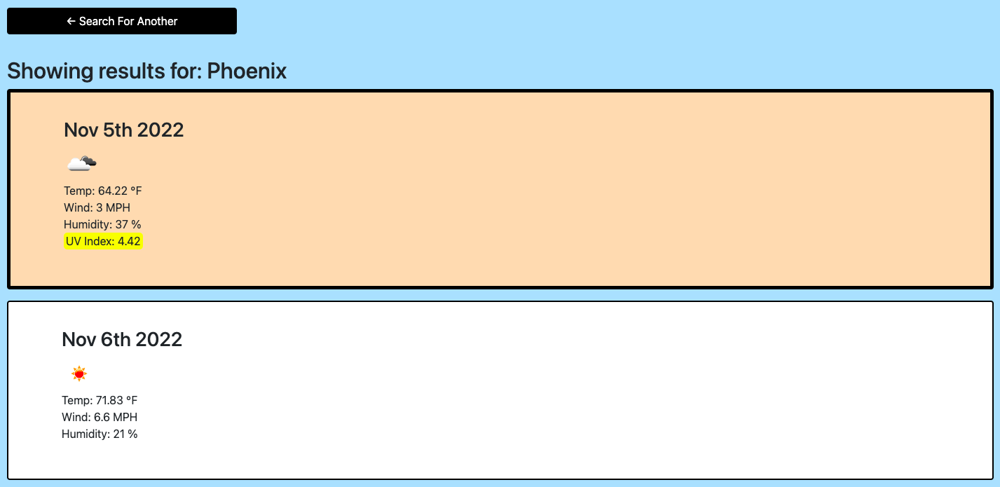

# Weather Dashboard

  

  
  
  
  

## Description

The purpose of this project was to utilize a server-side API to retrieve and display the weather forecast when a location is searched for. This is useful for a user to be able to plan their day accordingly and plan upcoming travel accordingly. Over the course of building this project, I became comfortable with creating fetch requests and extracting and manipulating desired data points. 

## Table of Contents

  - [Installation](#installation)
  - [Usage](#usage)
  - [Credits](#credits)
  - [License](#license)
  - [Contributing](#contributing)
  - [Tests](#tests)
  - [Questions](#questions)

## Installation

N/A

## Usage

To access this application, visit the following URL: [https://rpecuch.github.io/weather-dashboard/](https://rpecuch.github.io/weather-dashboard/). Simply type in a city name to retrieve the weather forecast.

Current conditions as well as the forecast for the next 5 days will be generated.

Each city that is searched for will be saved in the search history. Users may click on the saved city names to again view the weather forecast.

## Credits

The following APIs were utilized to build this project: OpenWeather One Call API, Bootstrap, Moment.js and jQuery.

## License

Please refer to the license in the repo.

  ## Contributing

  Ways to contribute include suggesting bug fixes.
  
  ## Tests

  N/A

  ## Questions

  If you have any questions or would like to provide feedback, do not hesitate to view my GitHub profile at [https://github.com/rpecuch](https://github.com/rpecuch) or contact me at rpecuch@comcast.net.